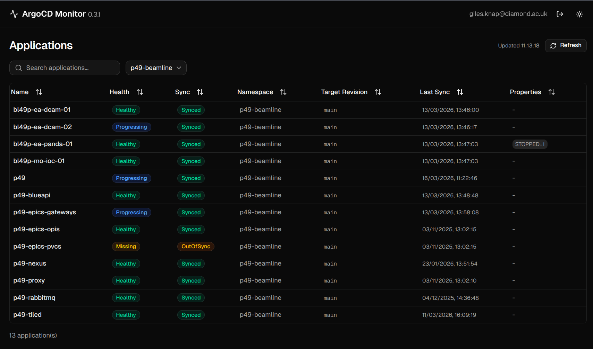

[](https://github.com/epics-containers/argocd-monitor/actions/workflows/ci.yml)

# ArgoCD Monitor

A React + TypeScript + Vite dashboard for monitoring ArgoCD application state.

Source          | <https://github.com/epics-containers/argocd-monitor>
:---:           | :---:
Container       | `ghcr.io/epics-containers/argocd-monitor`
Helm Chart      | `oci://ghcr.io/epics-containers/charts/argocd-monitor`
Documentation   | <https://epics-containers.github.io/argocd-monitor>
Releases        | <https://github.com/epics-containers/argocd-monitor/releases>

## Features

- Real-time application health and sync status overview
- Sortable, filterable applications table
- Detailed application view with pod info, images, and age
- Pod log streaming with container selection
- Pod restart with confirmation dialog
- Automatic token refresh for uninterrupted sessions
- Light and dark theme support

## Example Screenshot

<!-- begin screenshot -->

<!-- end screenshot -->

## Quick Start

The easiest way to run this project is using a
[Dev Container](https://containers.dev/), which provides a fully configured
development environment.

1. Clone the repository and open in VS Code:
   ```sh
   git clone https://github.com/epics-containers/argocd-monitor.git
   code argocd-monitor
   ```
2. Reopen in the Dev Container when prompted.
3. Copy `.env.example` to `.env` and set `ARGOCD_AUTH_TOKEN`.
4. Start the dev server:
   ```sh
   npm run dev
   ```
5. Open <http://localhost:5173>.

## Kubernetes Deployment

Install from the OCI Helm chart registry:

```bash
helm install argocd-monitor oci://ghcr.io/epics-containers/charts/argocd-monitor \
  --set argocd.url=https://argocd.example.com \
  --set ingress.enabled=true \
  --set ingress.host=argocd-monitor.example.com
```

<!-- README only content. Anything below this line won't be included in index.md -->

See <https://epics-containers.github.io/argocd-monitor> for full documentation.
